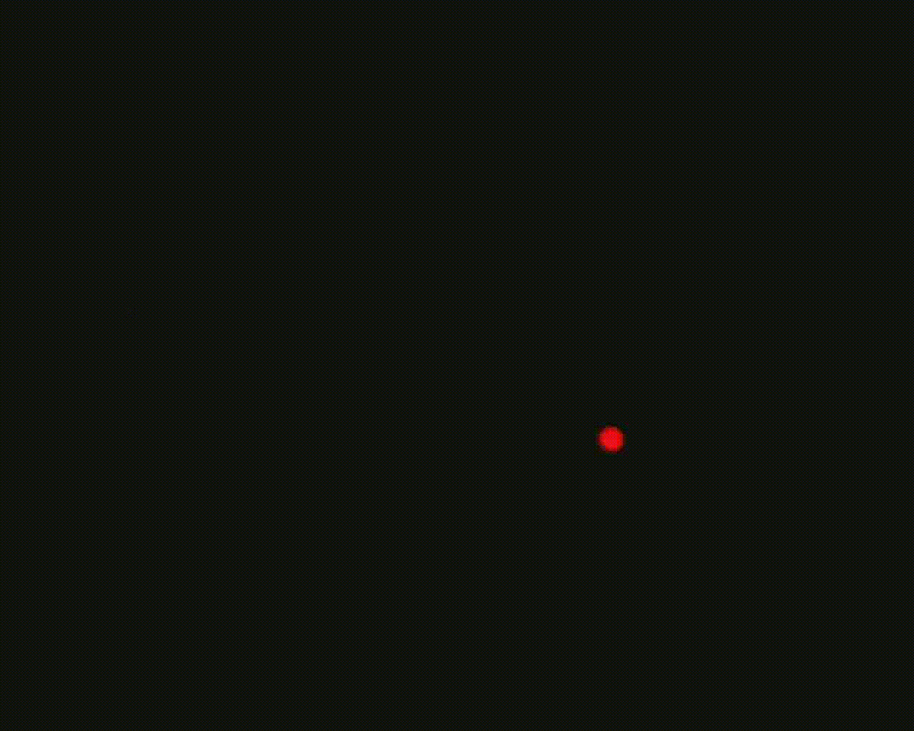

# Laser Characterization WIP

### Figures

1.

    <figure><figcaption></figcaption></figure>
2.

    <figure><figcaption></figcaption></figure>

3.

    <figure><figcaption></figcaption></figure>

4.

    <figure><figcaption></figcaption></figure>

5.

    <figure><figcaption></figcaption></figure>

6.

    <figure><figcaption></figcaption></figure>
7.

    <figure><figcaption></figcaption></figure>

8.

    <figure><figcaption></figcaption></figure>

9.

    <figure><figcaption></figcaption></figure>

10.

    <figure><figcaption></figcaption></figure>

11.

    <figure><figcaption>
As captured by the CMOS
</figcaption></figure>

12.

    <figure><figcaption></figcaption></figure>

13.

    <figure><figcaption></figcaption></figure>

14.

    <figure><figcaption>
As seen by the CMOS
</figcaption></figure>
15.

    <figure><figcaption></figcaption></figure>

16.

    <figure><figcaption></figcaption></figure>

17.

    <figure><figcaption>
As seen by the CMOS
</figcaption></figure>
18.

    <figure><figcaption></figcaption></figure>

19.

    <figure><figcaption></figcaption></figure>
20.

    <figure><figcaption>
As seen by the CMOS
</figcaption></figure>

21.

    <figure><figcaption>
With 90:10 splitter and corrected magnification
</figcaption></figure>

22.

    <figure><figcaption></figcaption></figure>

23.

    <figure><figcaption>
As seen by the CMOS (Due to exposure time requirements of the CMOS, nothing is visible until the bead stops moving)
</figcaption></figure>
