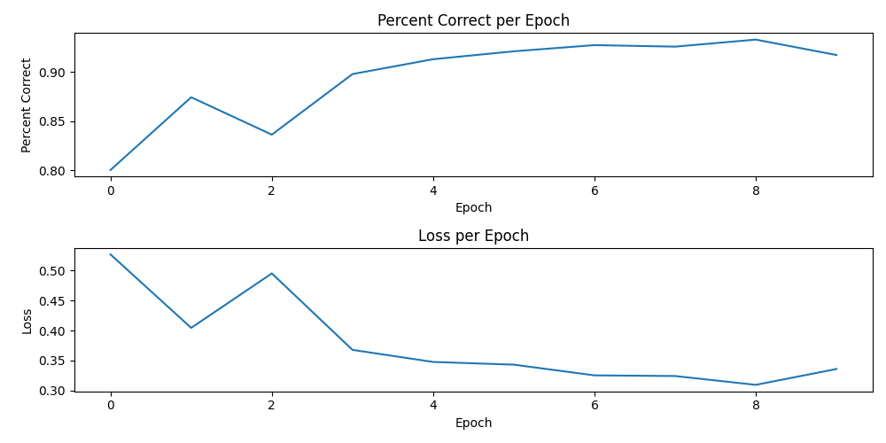

# PaReport on Image Segmentation Challenges and Model Evaluation

### **Abstract**

This report outlines the diagnostic steps taken to address the low accuracy observed in the U-Net model during image segmentation tasks involving fluorescent beads. The primary aim was to discern whether the model design or the dataset was the issue's source. A detailed examination involving a binary classifier based on the ResNet architecture provided significant insights into the underlying problems.

### **Introduction**

Recent experiments utilizing the U-Net model for segmenting images of fluorescent beads have demonstrated suboptimal accuracy. Given the model's previous success in other contexts, it was crucial to determine whether the poor performance was due to inherent limitations in the model or inadequacies in the dataset used for training and validation.

### **Methodology**

To isolate the cause of the low accuracy, a binary classification test was conducted using a ResNet-50 model pre-trained on the ImageNet dataset. This approach was chosen to leverage transfer learning, enhancing the model's ability to generalize previously learned features to new tasks. The dataset comprised 40,000 16-bit TIFF images of fluorescent beads, captured at 40x magnification using a Thorlabs 1.6MP monochrome Zelux camera through a diffractive filter array (DFA). Before training, images were pre-processed to remove empty, excessively noisy, or significantly overexposed frames. The pixel values were normalized against the maximum value observed in the dataset.

### **Results**

After training for eight epochs, the ResNet-50 model achieved an accuracy of over 90%. This performance significantly exceeds the initial threshold of 80% set to evaluate the adequacy of the dataset, indicating that the dataset likely does not contribute to the observed issues with the U-Net model.

### **Discussion**

The high accuracy of the ResNet model suggests that the dataset, including its diversity and the information it encapsulates, is sufficient for training effective image segmentation models. Therefore, the problems with the U-Net model might be attributed to its architectural choices or specific configurations used in the previous experiments.

The Captum library was utilized further to understand the decision-making process of the ResNet model. This tool helped highlight the most influential features in the model's predictions, distinguishing between features that had positive and negative impacts on the decision-making process.

### **Conclusion**

The investigation strongly indicates that the U-Net model's issues stem from within its design rather than the dataset. Future work should focus on adjusting the U-Net model's architecture or exploring alternative models better suited for this specific image data type. Further analysis using tools like Captum can provide deeper insights into model behavior, potentially guiding more targeted improvements.

### **Recommendations**

* Re-evaluate the U-Net model's design and configuration settings to identify potential areas for improvement.
* Consider alternative segmentation models that may offer better performance with the given dataset.
* Analytical tools like Captum can be used to understand model behaviors and decision-making processes better.

### Figures

1.

    <figure><figcaption>
Evaluation Graph For Resnet Classifier
</figcaption></figure>

2.

    <figure><figcaption>
Green indicates pixels that influence the model towards its prediction and red, pixels that influence the model away from the same
</figcaption></figure>

3.

    <figure><figcaption></figcaption></figure>

4.

    <figure><figcaption></figcaption></figure>

5.

    <figure><figcaption></figcaption></figure>

6.

    <figure><figcaption></figcaption></figure>

7.

    <figure><figcaption></figcaption></figure>

